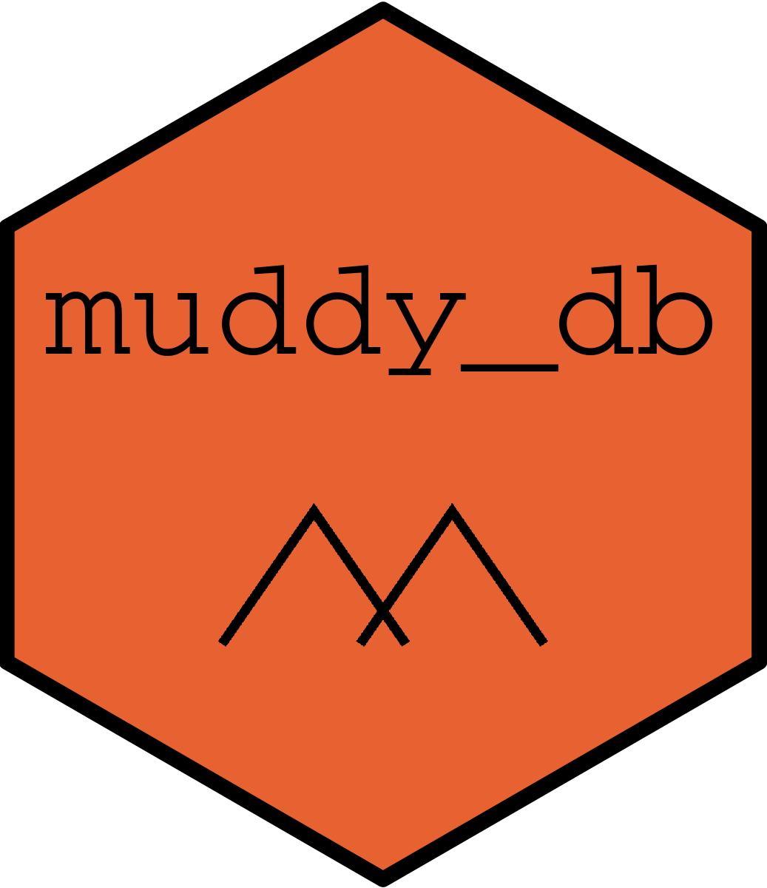

<!-- README.md is generated from README.Rmd. Please edit that file -->

```{r, include = FALSE}
knitr::opts_chunk$set(
  collapse = TRUE,
  comment = "#>",
  fig.path = "man/figures/README-",
  out.width = "100%"
)
```

# muddy_db 
<!-- badges: start -->
[](https://www.tidyverse.org/lifecycle/#experimental)

<!-- badges: end -->

### Description

**muddy_db** represents a biologically-oriented mud volcano database. 
It aggregates mud volcano specific terminology and taxonomy, which were mined 
from open-access articles, available in the [S2ORC](https://github.com/allenai/s2orc/)
database [@lo-wang-2020-s2orc]. We used [ScispaCy](https://github.com/allenai/scispacy)
[@neumann_2019_scispacy] models and [ETE3](https://github.com/etetoolkit/ete) [@cepas_2016]
library to check taxonomy-flavored tokens against
[NCBI Taxonomy](ftp://ftp.ncbi.nlm.nih.gov/pub/taxonomy/) database.  

Check our mining pipeline: [muddy_mine](https://github.com/TracyRage/muddy_mine)

### Data

**muddy_db** includes the following data:

* Bacterial and archaeal taxonomy (phylum, class, order, family, genus)
* Chemistry (inorganic ions, hydrocarbons)
* Geology (geological periods, minerals)
* Mud volcano specific data (microbial consortia, metabolic pathways etc.)
* Methods (amplified genes, analytics)

### References